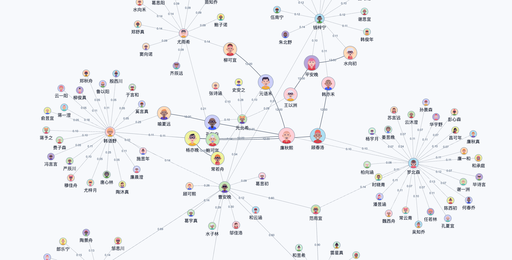

# Open Social Graph Explorer

OSGE（Open Social Graph Explorer）是一个本地优先、源代码开放的非商业社交数据关系图谱研究工具，用于采集公开或已授权的账号数据、构建关系网络、分析节点重要性并生成可交互图谱。

## 核心能力

- 多平台公开数据采集
- 平台账号关系图构建
- 评论、回复、转发、提及、关注等关系建模
- 边权重、置信度和证据保留
- PageRank、中心性、社区与加权度分析
- 本地 Web 图谱可视化
- 节点增量采集、隐藏和相邻孤立节点清理
- 账号层与身份容器层分离

## 图谱示例



## 系统架构概览

```text
Data Source
  -> Platform Adapter
  -> Storage
  -> Graph Builder
  -> Analysis Engine
  -> Visualization
```

当前代码结构：

```text
adapters/   平台 registry、平台 adapter、请求签名、解析和共享 HTTP/session 工具
core/       数据库、采集编排、归一化、边构建、分析、图谱渲染
web/        FastAPI 本地 Web 服务与图谱 API
scripts/    CLI、服务启动、数据库初始化、图谱构建与导出脚本
database/   可发布的脱敏 sample database；真实本地数据库不入库
docs/       架构、数据模型、伦理边界和开发说明
```

仓库当前未迁移到 `backend/`、`frontend/`、`crawler/` 目录。文档按现有可运行结构描述，避免为目录命名破坏代码路径。

## 快速开始

### 安装依赖

如果当前 Python 环境允许 pip 安装：

```bash
cd OSGE
python -m pip install -r requirements.txt
```

在 Debian、Raspberry Pi OS 等启用 PEP 668 的系统上，系统 Python 可能禁止直接 pip 安装依赖。此时使用虚拟环境或其他已管理的 Python 环境：

```bash
python -m venv .venv
.venv/bin/python -m pip install -r requirements.txt
```

运行命令默认使用当前 `python`。如果未激活虚拟环境但需要使用其中依赖，CLI 命令可用 `.venv/bin/python ...`，服务脚本可设置 `OSGE_PYTHON=.venv/bin/python`。

需要平台采集时，确保本机有可用 Chromium。抖音签名依赖 `pyexecjs` 和本机 JavaScript runtime；小红书签名当前依赖 `xhshow`。

### 初始化数据库

```bash
python scripts/init_db.py
```

默认数据库：

```text
data/database/osge_overlay.db
```

真实运行数据库不进入 Git。仓库中的脱敏样例库位于：

```text
database/osge_sample.db
```

### 启动本地服务

```bash
scripts/osge_service.sh start
```

打开：

```text
http://127.0.0.1:8010/graph
```

常用服务命令：

```bash
scripts/osge_service.sh status
scripts/osge_service.sh restart
scripts/osge_service.sh stop
```

使用 sample database 启动：

```bash
scripts/osge_sample_service.sh start
```

sample 服务默认使用 `8011` 端口，避免占用正式服务的 `8010`：

```text
http://127.0.0.1:8011/graph
```

常用 sample 服务命令：

```bash
scripts/osge_sample_service.sh status
scripts/osge_sample_service.sh restart
scripts/osge_sample_service.sh stop
```

sample 启动脚本会优先使用 `.venv/bin/python`，也可以通过 `OSGE_PYTHON=/path/to/python` 指定解释器。sample database 保留脱敏后的小红书和抖音图谱数据，用于本地 UI 和图谱功能演示。

### 手动构建与渲染

```bash
python scripts/build_edges.py --db data/database/osge_overlay.db
python scripts/analyze_graph.py --db data/database/osge_overlay.db
python scripts/render_graph.py \
  --db data/database/osge_overlay.db \
  --platform xiaohongshu \
  --output data/processed/osge_graph.html
```

### 平台采集

Web 图谱页面可以提交采集任务。CLI 使用统一入口：

```bash
python scripts/expand_account.py --platform xiaohongshu --account xiaohongshu:<profile_id>
python scripts/expand_account.py --platform douyin --account douyin:<sec_uid>
```

采集任务复用本地 Chromium CDP profile。当前默认 profile 位于：

```text
${XDG_CACHE_HOME:-$HOME/.cache}/osge-chromium
```

如果平台 profile 获取失败，先在该 Chromium 窗口中打开对应平台，完成登录或验证，再重试采集。

## 当前项目状态

OSGE 当前处于早期研究原型阶段。

已实现：

- SQLite overlay 数据库
- Xiaohongshu 与 Douyin 最小采集 adapter，已完成本地 profile、post、comment 采集验证
- 平台 registry 与通用 expansion runner
- 账号、帖子、互动、边、证据和节点评分表
- 评论和回复关系的边权重计算
- NetworkX 图分析
- FastAPI 本地 Web 服务
- pyvis / vis-network 图谱渲染
- 基于 registry metadata 的动态图谱平台 UI

待完善：

- 更完整的自动化测试
- 平台 adapter 包结构拆分
- 上游代码和签名资产的再分发权限确认
- 数据删除和审计流程

## 文档索引

- [架构说明](docs/ARCHITECTURE.md)
- [数据模型](docs/DATA_MODEL.md)
- [伦理与边界](docs/ETHICS.md)
- [开发说明](docs/DEVELOPMENT.md)
- [路线图](ROADMAP.md)
- [安全政策](SECURITY.md)
- [第三方声明](THIRD_PARTY_NOTICES.md)

## 许可证

OSGE 原创代码和文档使用 [OSGE Non-Commercial Research License 1.0](LICENSE)。

本项目仅允许非商业学习、研究、审计和个人实验用途。禁止用于商业采集、商业画像、监控、数据转售、获客、风控评分、广告营销或竞争情报等场景。

第三方依赖、平台签名资产和参考项目仍适用各自许可证。详见 [第三方声明](THIRD_PARTY_NOTICES.md)。

## 免责声明

OSGE 仅处理公开可访问、已授权或用户自有的数据。

禁止使用本项目：

- 绕过平台权限、登录墙、验证码、限流或其他访问控制
- 采集私人数据、私信、非公开评论、非公开社群或受限资料
- 推断、曝光或追踪真实个人身份
- 进行人肉搜索、骚扰、监控或社工库建设

图谱节点默认表示平台账号，不表示真实世界中的个人。
